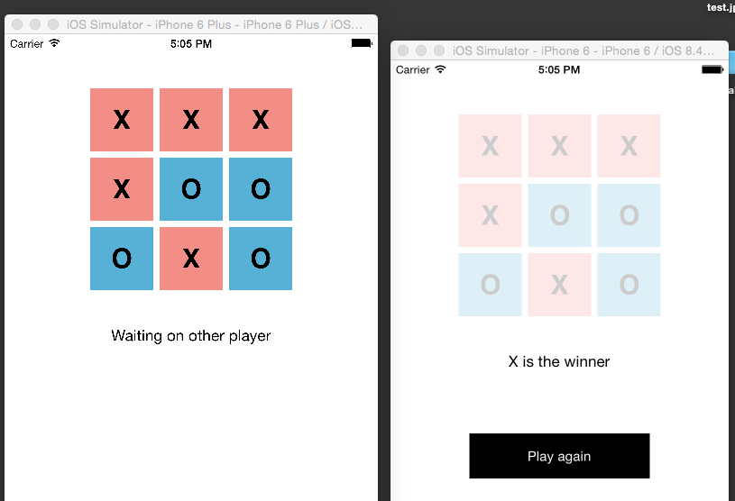

# SocketTicTacToe
Two player tic tac toe game

- Objective-C for client front-end
- uses Socket.IO's Cocoapod in Swift -> https://cocoapods.org/pods/Socket.IO-Client-Swift
- JS node server for game logic and game status dispatch 

To Do 

- temporarily using alpha for communicating other player's move - update to better UI, missing some status messages
- handle quit for your client, don't kill server 
- highlight winning three

